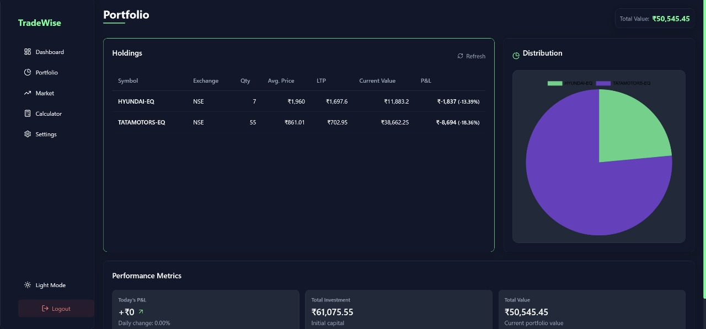

# <div align="center">TradewiseAI 📈💼🤖</div>

<div align="center">
  
  
  
  
  
  
</div>

<div align="center">
  <strong>Your Personal AI-Powered Financial Advisor</strong>
</div>

<div align="center">
  <sub>Built with ❤️ by <a href="https://github.com/P47Parzival/Au/tree/main">Code Cartels</a></sub>
</div>

<br />

<p align="center">
  
</p>

---

## ✨ Features

<table>
  <tr>
    <td width="50%">
      <h3 align="center">🤖 AI-Powered Financial Advice</h3>
      <p align="center">Personalized investment recommendations using LLAMA-3 via Groq API</p>
    </td>
    <td width="50%">
      <h3 align="center">📊 Real-Time Market Data</h3>
      <p align="center">Live stock market updates and tracking through Angel One API</p>
    </td>
  </tr>
  <tr>
    <td width="50%">
      <h3 align="center">🧮 ALL in 1 Calculator</h3>
      <p align="center">
      </p>
      <p align="center">Seamlessly link your Angel One account to track your portfolio</p>
    </td>
    <td width="50%">
      <h3 align="center">💬 AI Financial Assistant</h3>
      <p align="center">Real-time conversational AI to answer your financial questions</p>
    </td>
  </tr>
</table>

---

## 🎯 Project Overview

TradewiseAI revolutionizes personal finance by combining cutting-edge AI with real-time market data. Our platform enables users to:

- Receive **tailored investment advice** based on your financial goals and risk tolerance
- Monitor **real-time stock performance** with interactive visualizations
- Access your **actual portfolio holdings** directly from your Angel One account
- **Chat with our AI assistant** for instant answers to financial questions

---

## 📱 UI Showcase

<div align="center">
  <table>
    <tr>
      <td><br><em>Main Dashboard</em></td>
      <td><br><em>Portfolio Analysis</em></td>
    </tr>
    <tr>
      <td><br><em>Investment Calculator</em></td>
      <td><br><em>Chat Bot</em></td>
    </tr>
  </table>
</div>
<h4>We have both light and dark mode</h4>

## ⚙️ Tech Stack

<div align="center">
  <table>
    <tr>
      <th>Category</th>
      <th>Technologies</th>
    </tr>
    <tr>
      <td>Frontend</td>
      <td>
        
        
        
        
      </td>
    </tr>
    <tr>
      <td>Backend</td>
      <td>
        
      </td>
    </tr>
    <tr>
      <td>AI & Data</td>
      <td>
        
        
        
      </td>
    </tr>
    <tr>
      <td>Deployment</td>
      <td>
        
        
      </td>
    </tr>
  </table>
</div>

---

## ✅ Project Progress

<div align="center">
  <div style="background-color: #ddd; border-radius: 10px; height: 20px; width: 80%; margin: 0 auto;">
    <div style="background-color: #4CAF50; height: 100%; width: 100%; border-radius: 10px;"></div>
  </div>
</div>

### 🏆 Completed
- ✅ Modern responsive frontend with glass-morphism UI
- ✅ User authentication & account management
- ✅ Interactive financial dashboard
- ✅ Portfolio tracking visualization
- ✅ Investment calculator
- ✅ Database & backend architecture
- ✅ Angel One API connection
- ✅ Groq API integration for AI advice
- ✅ Real-time AI chat implementation
- ✅ Transaction history display
- ✅ Performance optimization
- ✅ Testing & documentation

---

## 🚀 Getting Started

```bash
# Clone the repository
git clone https://github.com/codecartels/tradewise.git

# Install dependencies
cd tradewise
npm install

# Set up environment variables
cp .env.example .env
# Add your API keys to .env file

# Start the development server
npm run dev
```

---

## 👥 The Team Code Cartels

<p align="center">
  
</p>

---

<div align="center">
  <sub>© 2025 Code Cartels. All rights reserved.</sub>
  <br />
  <sub>Made with 💻 and ☕ for the FinTech Hackathon</sub>
</div>
